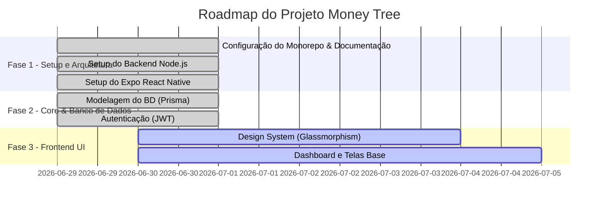

# Cérebro do Projeto - Money Tree (VerdeCo)

Este é o documento central de documentação e contexto do projeto.

## 2.1. ⚠️ INSTRUÇÕES IMPORTANTES - LEIA PRIMEIRO

**Para a Inteligência Artificial / Agente**:
- Sempre que iniciar uma sessão com este repositório ou quando o contexto for perdido, leia este documento para recuperar o estado atual do projeto. Mantenha as seções abaixo rigorosamente atualizadas conforme as regras em `docs/GUIA_DOCUMENTACAO.md`.
- **⚠️ PROTEÇÃO DE CREDENCIAIS (CRÍTICO):** Nunca exponha chaves de API, senhas, tokens ou strings de conexão no chat ou em arquivos de código rígido (hardcoded) versionados. Sempre salve dados sensíveis em arquivos `.env` locais (já ignorados no `.gitignore`) e acesse-os por variáveis de ambiente.

**Comando de Recuperação de Contexto (Golden Prompt):**
> *"Leia o documento `docs/documentation.md` para recuperar o contexto do projeto, veja as regras no arquivo `docs/GUIA_DOCUMENTACAO.md` e aguarde minhas próximas instruções."*

### Gatilhos de Atualização

| Gatilho | Ação a ser tomada |
| :--- | :--- |
| **Fim de Funcionalidade** | Atualize o **Log de Atividades** e remova o item das **Pendências**. |
| **Nova Solicitação Grande** | Resuma o prompt na seção **O Que Foi Solicitado**. |
| **Novo Arquivo/Pasta** | Atualize o inventário em **O Que Já Foi Desenvolvido**. |
| **Mudança de Rota/Tecnologia** | Registre na seção **Alterações Solicitadas & Decisões de Design**. |

---

## 2.2. 🛠️ Skills Utilizados

Abaixo estão as "Skills" (comportamentos de IA) que pautam o projeto:

- `react-native-architecture` (Mobile, offline-first)
- `nodejs-backend-patterns` (Backend limpo, SOLID, TypeScript)
- `product-inventor` & `ui-ux-pro-max` (Design Apple-like, Glassmorphism, foco em tranquilidade financeira)
- `frontend-security-coder` / `backend-security-coder` (Práticas de proteção a dados sensíveis)

---

## 2.3. 📝 O Que Foi Solicitado

- **29/06/2026:**
  - O usuário solicitou a criação de um **Organizador financeiro** ("FinanciLife / moneyTree") para uso diário de uma pessoa comum.
  - Objetivo: Registrar entradas, saídas, parcelamentos, gestão de cartões de crédito e metas (savings).
  - Plataformas: Foco em **App Web Responsivo**, mas com a exigência de que possa ser empacotado/distribuído como um **App Mobile** também.
  - O usuário providenciou um `Descritivo_antigo_app.md` (agora fundido ao README) com Identidade Visual (Verde/Off-white/Dark Forest) e divisão de telas (Dashboard, Orçamento, Faturas, Histórico, Gráficos, Planos e Ajustes).
  - Acordado um Backend isolado para garantir melhor performance nativa de comunicação com bancos de dados e independência de clientes.

---

## 2.4. ⚙️ Definição Técnica & Arquitetura

- **Frontend (Web & Mobile):** React Native + Expo (com Expo Router). Escolha estratégica para permitir um código único que gere tanto o App nativo (iOS/Android) quanto uma versão Web responsiva excelente.
- **Backend (API Rest):** Node.js com TypeScript (Express ou NestJS, a definir detalhadamente). Responsável por validação de regras de negócio e controle central de banco.
- **Banco de Dados:** PostgreSQL (Relacional, perfeito para controle de transações financeiras e controle de contas a pagar). Integrado via Prisma ORM.
- **Identidade Visual:** UI Glassmorphism (efeito translúcido), cantos arredondados, Micro-animações (via Reanimated/Moti).

---

## 2.5. 📋 Status do Projeto & Fases

**Fase Atual:** Fase 3 (Desenvolvimento e Polimento do Frontend / Integração).

---

## 2.6. 📦 O Que Já Foi Desenvolvido

- `README.md` — Descritivo principal, identidade visual e documentação de telas do projeto.
- `docs/documentation.md` — Este arquivo, base central do cérebro do projeto.
- `skill/GUIA_DOCUMENTACAO.md` — Guia usado como template para documentação.
- `backend/` — API REST em Node.js com Express, TypeScript, Prisma ORM e suporte a autenticação real/mock do Firebase.
- `frontend/` — App em React Native (Expo) com abas (Dashboard, Orçamento, Faturas, Histórico, Gráficos, Ajustes e Admin), Zustand e motor de sincronização local-nuvem.

---

## 2.7. ⏳ O Que Ainda Falta (Pendências)

- [ ] Importar/Migrar dados reais históricos da planilha `New Contas 2025.xlsx` para testes avançados locais.

---

## 2.8. 🔄 Alterações Solicitadas & Decisões de Design

- **Decisão (29/06/2026):** Arquitetura Backend. O Next.js permite um ecossistema unificado, mas como há o requisito forte de app Web *e* Mobile com persistência consistente e escalável, decidiu-se usar um Backend Node separado e puro para entregar as APIs, garantindo que o App Mobile (Expo) não consuma rotas acopladas a views da web.
- **Decisão (29/06/2026):** Banco de dados PostgreSQL escolhido por sua consistência com dados financeiros estruturados.
- **Decisão (30/06/2026):** Hospedagem do banco PostgreSQL na Supabase. Devido a restrições de rede local (IPv4) com a porta direta IPv6 da Supabase, foi adotado o uso de Connection Pooler (Supavisor) na porta `5432` com host pooler IPv4 (`aws-1-sa-east-1.pooler.supabase.com`) no backend.
- **Decisão (30/06/2026):** Segurança de Credenciais. Para evitar exposição de chaves no repositório Git, as credenciais do Firebase no frontend foram migradas para variáveis de ambiente locais usando o padrão do Expo (`EXPO_PUBLIC_...`) no arquivo `frontend/.env`.
- **Decisão (30/06/2026):** Alternância manual de temas. O app agora utiliza uma Zustand store com persistência local em AsyncStorage para permitir que o usuário mude livremente entre Light e Dark via cabeçalho.
- **Decisão (30/06/2026):** Deploy Serverless Vercel. O backend foi reestruturado para rodar como Serverless Functions na Vercel, com suporte a CORS seguro e conexões pooling persistentes ao Supabase PostgreSQL.
- **Decisão (30/06/2026):** Bypass local de JWT. Para acelerar o desenvolvimento local, implementou-se um decodificador de token Firebase JWT sem assinatura criptográfica (apenas decodificação base64) para ambientes onde as chaves de serviço do Firebase não estão presentes no `.env` do backend, mantendo a autenticação segura estrita ativa em produção.
- **Decisão (30/06/2026):** Ocultação de Planos. A aba e a barra de menu superior de planos foram ocultadas com `href: null` até a integração das APIs de checkout (Stripe/Asaas).
- **Decisão (30/06/2026):** Auto-Refresh nas Abas. As telas Dashboard, Gráficos e Histórico foram submetidas a subscrições de estado reativas às transações (`entries`, `exits`, `recurrings`, `purchases`), forçando a atualização instantânea do app quando inserções ou deleções são efetuadas.
- **Decisão (30/06/2026):** Toggle de Edição de Perfil. O formulário de dados de perfil agora possui um estado `isEditing`. Em modo de leitura, exibe os campos em visual flat integrado (sem borda de input) e botão "Editar Dados" em cor neutra. Em modo edição, insere bordas, libera alteração e exibe botão "Salvar" na cor verde esmeralda.
- **Decisão (30/06/2026):** Máscaras de Digitação. Máscaras de celular no formato `(DD) 99999-9999` e de data em `DD/MM/AAAA` integradas em tempo de digitação nas telas de Cadastro e Ajustes.
- **Decisão (30/06/2026):** Validação de Senha Antiga. A alteração de senha passa a exigir a digitação da senha antiga. Em produção, isso é validado via reautenticação no Firebase Auth; em ambiente local mock, valida-se contra a senha existente no banco de dados. Contas Google OAuth têm a seção de senha totalmente oculta.

---

## 2.9. 📝 Log de Atividades

| Data | Atividade Realizada | Desenvolvedor (IA ou Humano) | Status |
| :--- | :--- | :--- | :--- |
| 29/06/2026 | Inicialização do Repositório Git e Commit Inicial | Humano/IA | ✅ Concluída |
| 29/06/2026 | Criação do `docs/documentation.md` com Brainstorm e Arquitetura | IA | ✅ Concluída |
| 30/06/2026 | Auditoria técnica do monorepo, validação de tipos e alinhamento com a planilha | IA | ✅ Concluída |
| 30/06/2026 | Cadastro de novos usuários (celular, data nasc), validações de senha complexa, confirmação de senha, suporte BD/API e ajustes de perfil | IA | ✅ Concluída |
| 30/06/2026 | Integração e migração do banco de dados local para PostgreSQL na nuvem (Supabase via Connection Pooler IPv4) | IA | ✅ Concluída |
| 30/06/2026 | Migração das credenciais hardcoded do Firebase no frontend para variáveis de ambiente locais (.env) | IA | ✅ Concluída |
| 30/06/2026 | Integração de micro-animações premium (transições fade-in e slide-up reativas) no Dashboard e Orçamento | IA | ✅ Concluída |
| 30/06/2026 | Botão manual de alternância de tema (Claro/Escuro) no menu superior, integrado a Zustand e persistido | IA | ✅ Concluída |
| 30/06/2026 | Estruturação e Deploy do Backend na Vercel Serverless com banco Supabase de Produção | IA | ✅ Concluída |
| 30/06/2026 | Implementação de bypass de validação de token Firebase JWT para testes de API locais e correção de login | IA | ✅ Concluída |
| 30/06/2026 | Auto-refresh dinâmico reativo às stores de finanças no Dashboard, Gráficos e Histórico | IA | ✅ Concluída |
| 30/06/2026 | Implementação de visualização/edição e máscaras de celular/data no Perfil (Ajustes e Registro) | IA | ✅ Concluída |
| 30/06/2026 | Criação de verificação de senha antiga para troca e ocultação para contas de login Google | IA | ✅ Concluída |
| 30/06/2026 | Modificação do card de plano vigente para "Em breve" e ocultação de rotas de planos | IA | ✅ Concluída |
