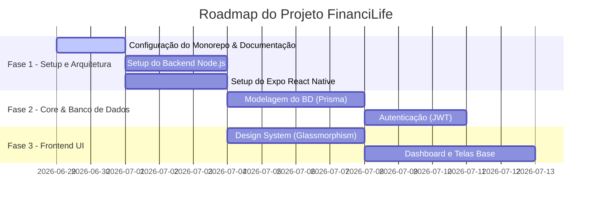

# Cérebro do Projeto - FinanciLife (moneyTree)

Este é o documento central de documentação e contexto do projeto.

## 2.1. ⚠️ INSTRUÇÕES IMPORTANTES - LEIA PRIMEIRO

**Para a Inteligência Artificial / Agente**:
Sempre que iniciar uma sessão com este repositório ou quando o contexto for perdido, leia este documento para recuperar o estado atual do projeto. Mantenha as seções abaixo rigorosamente atualizadas conforme as regras em `docs/GUIA_DOCUMENTACAO.md`.

**Comando de Recuperação de Contexto (Golden Prompt):**
> *"Leia o documento `docs/documentation.md` para recuperar o contexto do projeto, veja as regras no arquivo `docs/GUIA_DOCUMENTACAO.md` e aguarde minhas próximas instruções."*

### Gatilhos de Atualização

| Gatilho | Ação a ser tomada |
| :--- | :--- |
| **Fim de Funcionalidade** | Atualize o **Log de Atividades** e remova o item das **Pendências**. |
| **Nova Solicitação Grande** | Resuma o prompt na seção **O Que Foi Solicitado**. |
| **Novo Arquivo/Pasta** | Atualize o inventário em **O Que Já Foi Desenvolvido**. |
| **Mudança de Rota/Tecnologia** | Registre na seção **Alterações Solicitadas & Decisões de Design**. |

---

## 2.2. 🛠️ Skills Utilizados

Abaixo estão as "Skills" (comportamentos de IA) que pautam o projeto:

- `react-native-architecture` (Mobile, offline-first)
- `nodejs-backend-patterns` (Backend limpo, SOLID, TypeScript)
- `product-inventor` & `ui-ux-pro-max` (Design Apple-like, Glassmorphism, foco em tranquilidade financeira)
- `frontend-security-coder` / `backend-security-coder` (Práticas de proteção a dados sensíveis)

---

## 2.3. 📝 O Que Foi Solicitado

- **29/06/2026:**
  - O usuário solicitou a criação de um **Organizador financeiro** ("FinanciLife / moneyTree") para uso diário de uma pessoa comum.
  - Objetivo: Registrar entradas, saídas, parcelamentos, gestão de cartões de crédito e metas (savings).
  - Plataformas: Foco em **App Web Responsivo**, mas com a exigência de que possa ser empacotado/distribuído como um **App Mobile** também.
  - O usuário providenciou um `Descritivo_antigo_app.md` (agora fundido ao README) com Identidade Visual (Verde/Off-white/Dark Forest) e divisão de telas (Dashboard, Orçamento, Faturas, Histórico, Gráficos, Planos e Ajustes).
  - Acordado um Backend isolado para garantir melhor performance nativa de comunicação com bancos de dados e independência de clientes.

---

## 2.4. ⚙️ Definição Técnica & Arquitetura

- **Frontend (Web & Mobile):** React Native + Expo (com Expo Router). Escolha estratégica para permitir um código único que gere tanto o App nativo (iOS/Android) quanto uma versão Web responsiva excelente.
- **Backend (API Rest):** Node.js com TypeScript (Express ou NestJS, a definir detalhadamente). Responsável por validação de regras de negócio e controle central de banco.
- **Banco de Dados:** PostgreSQL (Relacional, perfeito para controle de transações financeiras e controle de contas a pagar). Integrado via Prisma ORM.
- **Identidade Visual:** UI Glassmorphism (efeito translúcido), cantos arredondados, Micro-animações (via Reanimated/Moti).

---

## 2.5. 📋 Status do Projeto & Fases

**Fase Atual:** Fase 1 (Setup e Documentação Inicial).

---

## 2.6. 📦 O Que Já Foi Desenvolvido

- `README.md` — Descritivo principal, identidade visual e documentação de telas do projeto (herdado do `Descritivo_antigo_app.md`).
- `docs/documentation.md` — Este arquivo, base central do cérebro do projeto.
- `skill/GUIA_DOCUMENTACAO.md` — Guia usado como template para documentação.

---

## 2.7. ⏳ O Que Ainda Falta (Pendências)

- [ ] Definir a estrutura do monorepo (ou separação de pastas `api` e `app`).
- [ ] Inicializar o Backend Node.js (package.json, dependências, tsconfig).
- [ ] Inicializar o Frontend Expo.
- [ ] Modelar o banco de dados (Tabelas de Usuários, Transações, Cartões, Metas) usando as colunas da planilha do usuário como base/norte.

---

## 2.8. 🔄 Alterações Solicitadas & Decisões de Design

- **Decisão (29/06/2026):** Arquitetura Backend. O Next.js permite um ecossistema unificado, mas como há o requisito forte de app Web *e* Mobile com persistência consistente e escalável, decidiu-se usar um Backend Node separado e puro para entregar as APIs, garantindo que o App Mobile (Expo) não consuma rotas acopladas a views da web.
- **Decisão (29/06/2026):** Banco de dados PostgreSQL escolhido por sua consistência com dados financeiros estruturados.

---

## 2.9. 📝 Log de Atividades

| Data | Atividade Realizada | Desenvolvedor (IA ou Humano) | Status |
| :--- | :--- | :--- | :--- |
| 29/06/2026 | Inicialização do Repositório Git e Commit Inicial | Humano/IA | ✅ Concluída |
| 29/06/2026 | Criação do `docs/documentation.md` com Brainstorm e Arquitetura | IA | ✅ Concluída |
